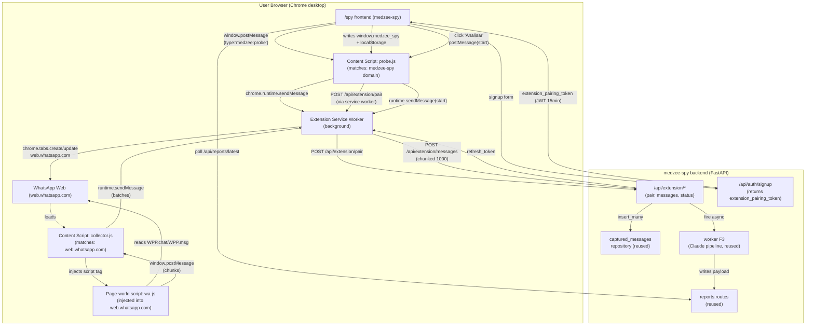

# F8 — Chrome Extension Ingestion · Design

**Spec:** `.specs/features/f8-chrome-extension-ingestion/spec.md`
**Context:** `.specs/features/f8-chrome-extension-ingestion/context.md`
**Status:** Draft

---

## 1. Architecture Overview

Pivô elimina o cliente WhatsApp do backend. A sessão real do user no `web.whatsapp.com` faz a coleta via extensão Chrome MV3. Backend só recebe POST batch já parseado e dispara worker F3 existente.



---

## 2. Knowledge Verification (research summary)

Áreas **incertas** que afetam o design — flagueadas honestamente:

### 2.1 WhatsApp Web internals (alto risco de mudança)

- **WhatsApp Web é E2E criptografado.** O IndexedDB armazena blobs criptografados; ler IndexedDB direto **não** entrega plaintext de mensagens (só metadata como contacts/contacts).
- **Pattern correto:** injetar script no page-world do `web.whatsapp.com` e acessar o módulo interno `Store` (também conhecido como `WPP` após injeção do wa-js). O `MsgStore` / `ChatStore` mantém os modelos em memória já decifrados pelo client.
- **Lib externa de referência:** [`@wppconnect/wa-js`](https://github.com/wppconnect-team/wa-js) ([npm](https://www.npmjs.com/package/@wppconnect/wa-js)) é a manutenção comunitária mais ativa. Expõe `WPP.chat.list()`, `WPP.chat.getMessages(chatId, { count })` etc.
- **Volatilidade:** `wa-js` recebe updates frequentes (semanal/quinzenal) quando WhatsApp Web minifia internals. Versão de produção precisa ser atualizada periodicamente.

**Decisão:** integrar `wa-js` como dependência do page-world script, fixar version range e ter pipeline mensal de update + smoke test em CI.

**Plano B (se wa-js quebrar gravemente):** fallback pra DOM scraping (lê painel de conversas + entra em cada chat + lê msgs). Mais lento, menos confiável, mas funciona sem depender do Store. Implementação P3.

### 2.2 Chrome MV3 service worker lifecycle

- Service worker termina após **5min idle**. State precisa vir de `chrome.storage` na re-ativação.
- Coleta de 30 dias pode levar 1-3 min com até 5k msgs — bem abaixo do limit.
- Para coletas grandes (10k+ msgs), implementar **chunking persistente** em `chrome.storage.local`: extensão guarda progresso ("chat 12/47, msg offset 320"), se service worker dorme, content-script reinicia coleta de onde parou.

**Decisão:** chunking ≥ batch boundaries (1000 msgs). Estado persistido em `chrome.storage.local` com TTL.

### 2.3 Detecção de extensão instalada (cross-context)

- Extensão **não pode** ser detectada via `navigator.userAgent` ou `window.chrome.extensions` por web pages comuns.
- Padrão estabelecido: extensão registra content script no domínio medzee-spy (via `matches` no manifest); content script escuta `window.postMessage({type:'medzee:probe'})` e responde com `window.postMessage({type:'medzee:installed', ...})`.
- Frontend faz probe com timeout 500ms; sem resposta = não instalada.

**Decisão:** content script `probe.js` em `https://*.medzee.com/*` + `http://localhost:5173/*` (dev) com `run_at: document_idle`.

---

## 3. Code Reuse Analysis

### 3.1 Componentes existentes reaproveitados

| Componente | Localização | Como usar |
|---|---|---|
| `WhatsAppProvider` Protocol | `backend/app/clients/whatsapp/__init__.py` | Adicionar adapter `extension.py` (no-op pra most operations, só "receive_messages") |
| `captured_messages.insert_many` | `backend/app/modules/captured_messages/repository.py` | Reaproveitar dedup batch + fallback row-by-row 23505 (L11) |
| `query_last_n_per_chat` | mesmo arquivo | Reaproveitar RPC `top_n_messages_per_chat` — F3 já espera essa shape |
| `stats_for_user` | mesmo arquivo | Reaproveitar `count="exact"` (L12) |
| Worker F3 (`generate_report_pipeline`) | `backend/app/workers/report.py` | Disparado por `/api/extension/messages` quando `total_batches` recebidos |
| Prompts F3/F5 | `backend/app/modules/reports/prompts/` | Sem mudança — input shape idêntico ao F5 (`ExtractedPayload`) |
| `AuthService.signup` | `backend/app/modules/auth/service.py` | Estende pra emitir `extension_pairing_token` no response |
| `get_current_user_id` (JWT) | `backend/app/core/security.py` | Reusar pra autenticar `/api/extension/*` via refresh-token |
| `LeadFormScreen` | `frontend/src/screens/LeadFormScreen.jsx` | Reusar como passo 1 do novo `/spy` invertido |
| `useMe` hook | `frontend/src/lib/me.js` | Reusar pra logar user automaticamente após signup |
| `ReportTopbar`, ReportDetailPage | `frontend/src/components/report/*` | Sem mudança |
| `useReportPolling` | `frontend/src/lib/reports.js` | Sem mudança |
| `ScopeWarningBanner` | `frontend/src/components/report/` | Sem mudança (mantém D10) |
| Feature flag pattern | `backend/app/core/config.py` (pydantic-settings) | Adicionar `WHATSAPP_PROVIDER` |

### 3.2 Pontos de integração

| Sistema | Método |
|---|---|
| Supabase Auth | Estende emissão do `extension_pairing_token` em `AuthService.signup` (JWT assinado com `SUPABASE_JWT_SECRET`, claims `{sub:user_id, typ:'extension_pairing', exp:+15min}`) |
| `medzee_spy.captured_messages` | Nova coluna `source TEXT NOT NULL DEFAULT 'webhook'` (`'webhook'` legado uazapi vs `'extension'`). Backfill `'webhook'` em rows existentes |
| `medzee_spy.whatsapp_sessions` | Não usada pela extensão. Quando `WHATSAPP_PROVIDER=extension`, cria-se uma row síntese só pra satisfazer o FK de `captured_messages` (`whatsapp_session_id`) — `id` derivado de `user_id` (1:1) + `provider='extension'`, sem dependência de uazapi |
| Worker F3 (`generate_report_pipeline`) | Disparado por nova função `service.trigger_generate_from_extension(user_id, batch_id)` |

### 3.3 Concerns mitigados

- **L11** (PostgREST + partial unique + on_conflict): `insert_many` já reaproveita a estratégia plain INSERT + dedup batch + fallback 23505. Nenhuma regressão.
- **L12** (PostgREST default Range 0-999): toda query usa `count="exact"` ou RPC.
- **L13** (Top-N em Python): worker F3 já usa RPC window function.
- **L14** (cleanup automático em erro transitório): F8 não tem "instância" externa → não há recurso pra deletar em erro.
- **D10** (relatório sempre gera): mantido — quando extensão envia 0 msgs, worker persiste `data_quality=insufficient` com diagnóstico.

---

## 4. Components

### 4.1 Backend — `app/clients/whatsapp/extension.py`

- **Purpose:** Strategy adapter pro provider "extension". A maioria dos métodos do `WhatsAppProvider` Protocol vira no-op ou raise — extension não tem QR/webhook/sessões no backend.
- **Location:** `backend/app/clients/whatsapp/extension.py`
- **Interfaces:**
  - `async def create_session() -> ProviderSession` → **raises** `ProviderNotApplicable` (extensão não cria sessão)
  - `async def refresh_qr(session_token) -> str` → **raises** `ProviderNotApplicable`
  - `async def list_chats(...)` → **raises** `ProviderNotApplicable`
  - `async def get_status(...) -> dict` → retorna `{"provider": "extension"}` (placeholder)
- **Dependencies:** nenhuma (sem httpx, sem uazapi)
- **Reuses:** `types.py` (ProviderSession), `errors.py` (nova exceção `ProviderNotApplicable`)

### 4.2 Backend — `app/modules/extension/`

Novo módulo dedicado. Mesmo padrão dos outros (`routes.py`, `service.py`, `repository.py`, `schemas.py`).

#### `schemas.py`

```python
# Wire shape do POST /api/extension/messages
class ExtensionMessageBatch(BaseModel):
    batch_id: str  # uuid v4 gerado pela extensão
    batch_index: int  # 0..N-1
    total_batches: int  # N
    extension_version: str  # X-Extension-Version
    messages: list[ExtensionMessage]

class ExtensionMessage(BaseModel):
    wa_chatid: str           # ex: "5511999999999@c.us" ou "...@g.us"
    wa_msg_id: str           # id único da msg no WhatsApp
    ts: datetime             # timestamp da msg (UTC)
    is_from_me: bool
    message_type: Literal["text","image","audio","video","sticker","document","other"]
    text: str | None = None
    contact_name: str | None = None
    wa_is_group: bool = False

# Wire shape do POST /api/extension/pair
class ExtensionPairRequest(BaseModel):
    pairing_token: str  # JWT emitido por /api/auth/signup
    extension_install_id: str  # gerado pela extensão (anônimo, persistente)

class ExtensionPairResponse(BaseModel):
    refresh_token: str  # JWT long-lived (30d), claims {sub:user_id, typ:'extension_refresh'}
    user_id: UUID

# GET /api/extension/status — quando frontend precisa saber estado
class ExtensionStatusResponse(BaseModel):
    paired: bool
    last_collection_at: datetime | None
    last_collection_message_count: int
    extension_min_version: str  # ex "1.0.0"
```

#### `routes.py`

```python
# POST /api/extension/pair — troca pairing_token por refresh_token
# Auth: pairing_token no body (JWT validado contra SUPABASE_JWT_SECRET)
@router.post("/pair", response_model=ExtensionPairResponse)
async def pair(...): ...

# POST /api/extension/messages — recebe batch chunked
# Auth: Authorization: Bearer <refresh_token>
# Headers: X-Extension-Version
# Body: ExtensionMessageBatch
# Response: 202 Accepted { received: int, deduped: int, total_received: int }
@router.post("/messages", status_code=202)
async def receive_messages(...): ...

# GET /api/extension/status — frontend pola pra saber se há coleta em andamento
# Auth: standard user JWT
@router.get("/status", response_model=ExtensionStatusResponse)
async def status(...): ...
```

#### `service.py`

```python
async def pair_extension(pairing_token: str, install_id: str) -> ExtensionPairResponse:
    # 1. Decode JWT (HS256 com SUPABASE_JWT_SECRET); valida typ=='extension_pairing'
    # 2. Persiste install_id em extension_installs (user_id, install_id, paired_at)
    # 3. Emite refresh_token (typ='extension_refresh', exp=+30d)
    # 4. Retorna par

async def ingest_batch(user_id, batch: ExtensionMessageBatch) -> dict:
    # 1. Mapeia ExtensionMessage[] → CapturedMessageInsert[] (com source='extension')
    # 2. Garante row em whatsapp_sessions pro user (helper get_or_create_extension_session)
    # 3. Chama captured_messages.insert_many (reusa dedup/fallback existentes)
    # 4. Se batch_index == total_batches - 1:
    #    - Dispara reports.service.trigger_generate(user_id, mode='last_n_per_chat')
    #    - Worker F3 lê de captured_messages via RPC top_n_messages_per_chat
    # 5. Retorna { received, deduped, total_received_so_far }
```

#### `repository.py`

```python
# extension_installs (nova tabela, ver §5.1)
async def upsert_install(user_id, install_id) -> None: ...
async def get_install(user_id) -> dict | None: ...

# whatsapp_sessions helper
async def get_or_create_extension_session(user_id) -> UUID:
    # SELECT id FROM whatsapp_sessions WHERE user_id=? AND provider='extension'
    # se não existe: INSERT com provider='extension', status='connected', uazapi_token=NULL
    # retorna id
```

### 4.3 Backend — `app/modules/auth/service.py` (extends)

```python
# Em AuthService.signup() — após criar user + profile:
extension_pairing_token = self._issue_pairing_token(user_id)
return AuthSignupResponse(
    user_id=user_id,
    session=session,  # já existe
    extension_pairing_token=extension_pairing_token,  # NOVO
)

def _issue_pairing_token(self, user_id: UUID) -> str:
    payload = {
        "sub": str(user_id),
        "typ": "extension_pairing",
        "iat": int(time.time()),
        "exp": int(time.time()) + 15 * 60,  # 15min TTL
    }
    return jwt.encode(payload, settings.SUPABASE_JWT_SECRET, algorithm="HS256")
```

#### Endpoint de re-emissão (CHX-15)

```python
# POST /api/auth/me/extension-pairing-token
# Auth: standard user JWT (get_current_user_id)
# Body: vazio
# Response: { extension_pairing_token: str }
@router.post("/me/extension-pairing-token", response_model=ExtensionPairingTokenResponse)
async def issue_extension_pairing_token(user_id: UUID = Depends(get_current_user_id)):
    return ExtensionPairingTokenResponse(
        extension_pairing_token=auth_service._issue_pairing_token(user_id),
    )
```

Idempotente: cada call emite token novo (15min TTL). Frontend chama silenciosamente quando probe da extensão volta `paired=false` mas user já tá logado.

### 4.4 Backend — `app/modules/extension/security.py`

```python
def get_current_extension_user(
    authorization: str = Header(...)
) -> UUID:
    # 1. Parse 'Bearer <refresh_token>'
    # 2. Decode JWT, valida typ=='extension_refresh', exp não-expirado
    # 3. Retorna user_id
    # 4. Em falha: HTTPException 401, code='pairing_expired'
```

### 4.5 Backend — `app/modules/extension/telemetry.py`

- **Purpose:** Sink de erros e eventos operacionais da extensão. Sem PII (mensagens nunca entram aqui).
- **Endpoint:** `POST /api/extension/telemetry` (auth: refresh_token bearer)
- **Body shape:**
  ```python
  class ExtensionTelemetryEvent(BaseModel):
      event: Literal[
          "collect_failed",      # wa-js incompatível, parse_error, etc.
          "collect_started",
          "collect_completed",
          "wa_needs_login",
          "service_worker_woke",
          "pairing_failed",
      ]
      extension_version: str
      reason: str | None = None         # human-readable (ex "wa_internals_changed")
      chats_total: int | None = None
      chats_processed: int | None = None
      duration_ms: int | None = None
      ua: str | None = None             # snapshot do user-agent
      # ZERO PII: nunca text, contact_name, wa_chatid, msg_id
  ```
- **Rate limit:** 60 eventos/min/user (proteção contra loop de erro)
- **Persistência:** tabela nova `medzee_spy.extension_telemetry` (RLS owner-only, TTL 90d via job cleanup já existente do F4 estendido)
- **Logs:** estruturados via `logger.info("ext.telemetry", extra={...})` — alerta Railway/Sentry quando `event='collect_failed'` excede threshold

### 4.6 Frontend — `MobileBlockScreen`

- **Purpose:** Tela fullscreen quando user acessa de mobile.
- **Location:** `frontend/src/screens/MobileBlockScreen.jsx`
- **Interfaces:** Componente puro, sem props (lê UA via `useIsMobile` hook).
- **Dependencies:** novo hook `useIsMobile` em `frontend/src/lib/device.js`
- **Reuses:** Tailwind classes do design system existente, ícone Lucide `Smartphone`

UI ASCII:
```
┌─────────────────────────────────────┐
│   📱 → 💻                            │
│                                     │
│  A análise do Medzee Spy roda só    │
│  no Chrome desktop.                 │
│                                     │
│  Abra este link no seu computador:  │
│  [medzee.com/spy        ] [Copiar]  │
│                                     │
│  ─── ou ───                         │
│                                     │
│  Enviar link pro meu email:         │
│  [seu@email.com.br      ] [Enviar]  │
└─────────────────────────────────────┘
```

### 4.7 Frontend — `ExtensionInstallScreen`

- **Purpose:** Tela mostrada após signup quando extensão não detectada.
- **Location:** `frontend/src/screens/ExtensionInstallScreen.jsx`
- **Interfaces:** Recebe `pairingToken` como prop, escreve em `window.medzee_spy` + `localStorage`.
- **Dependencies:** Probe via `useExtensionDetected` hook (timeout 500ms)
- **Reuses:** estilo dos cards existentes (`/spy` original)

UI ASCII:
```
┌─────────────────────────────────────┐
│  Passo 2/3                          │
│                                     │
│  Instale a extensão Medzee Spy      │
│                                     │
│  [ Instalar do Chrome Web Store ▶ ] │
│                                     │
│  ─── ou ───                         │
│                                     │
│  Em modo dev: load unpacked         │
│  /path/to/extension/                │
│                                     │
│  Aguardando instalação… ⏳          │
└─────────────────────────────────────┘
```

Polling: a cada 1s faz `window.postMessage({type:'medzee:probe'})`; quando recebe resposta `{type:'medzee:installed', paired:true}`, transiciona pra próxima tela.

### 4.8 Frontend — `/spy` route invertido

- **Purpose:** Orquestrador do fluxo novo (cadastro → install → analisar → relatório).
- **Location:** `frontend/src/screens/SpyFlowScreen.jsx` (reescrita do existente).
- **Estados internos** (state machine simples):
  ```
  START → SIGNUP → INSTALL → ANALYZE → GENERATING → DONE
                              ↘ WA_NEEDS_LOGIN
                              ↘ ABORTED → ANALYZE
  ```
- **Reuses:** `LeadFormScreen` no SIGNUP, `GeneratingScreen` (existente, agora consome dados reais da extensão via polling), `ReportDetailPage` no DONE.
- **Dependencies:** `useExtensionDetected`, `useExtensionMessages` (postMessage listener), `useReportPolling`.

### 4.9 Frontend — hooks novos

```js
// frontend/src/lib/extension.js

// Probe + state da extensão
export function useExtensionDetected(timeoutMs = 500) {
  // posta {type:'medzee:probe'} e escuta {type:'medzee:installed', paired}
  // retorna {installed: boolean|null, paired: boolean, version: string|null}
  // null = ainda detectando
}

// Envia comando pra extensão
export function sendToExtension(message) {
  // window.postMessage({type:'medzee:cmd', cmd:message.cmd, ...}, '*')
}

// Escuta eventos da extensão (coleta progresso)
export function useExtensionEvents() {
  // listener pra {type:'medzee:event', event:'collecting'|'wa_needs_login'|'aborted'|'done'}
}

// Injeta pairing token onde extensão consegue ler
export function injectPairingToken(token) {
  window.medzee_spy = { ...window.medzee_spy, pairing_token: token };
  localStorage.setItem('medzee_spy:pairing_token', token);
}

// frontend/src/lib/device.js
export function useIsMobile() {
  // detecta via UA + matchMedia('(pointer:coarse)') + screen.width
}
```

### 4.10 Chrome Extension — estrutura

Localização do código: `extension/` no monorepo (raiz, irmão de `backend/` e `frontend/`).

```
extension/
├── manifest.json                # MV3
├── package.json                 # build deps: typescript, vite, @wppconnect/wa-js
├── vite.config.ts               # bundle build
├── src/
│   ├── service-worker.ts        # background: pairing, batching, HTTP
│   ├── content-scripts/
│   │   ├── probe.ts             # injeta em medzee-spy domain
│   │   └── collector.ts         # injeta em web.whatsapp.com
│   ├── page-world/
│   │   └── wa-collector.ts      # roda no contexto da página, usa wa-js
│   ├── lib/
│   │   ├── storage.ts           # wrapper chrome.storage.local
│   │   ├── api-client.ts        # fetch wrapper com refresh_token
│   │   ├── chunker.ts           # batcher 1000 msgs
│   │   └── messages.ts          # tipos compartilhados frontend ↔ ext
│   └── popup/
│       ├── popup.html
│       ├── popup.tsx            # status visual (paired? collecting?)
│       └── popup.css
├── public/
│   ├── icon-16.png
│   ├── icon-48.png
│   └── icon-128.png
└── README.md                    # build + side-load + Web Store submission
```

#### `manifest.json` (resumo)

```json
{
  "manifest_version": 3,
  "name": "Medzee Spy",
  "version": "1.0.0",
  "description": "Análise comercial do WhatsApp para clínicas",
  "permissions": ["storage", "tabs", "scripting", "activeTab"],
  "host_permissions": [
    "https://web.whatsapp.com/*",
    "https://*.medzee.com/*",
    "http://localhost:5173/*"
  ],
  "background": { "service_worker": "service-worker.js" },
  "content_scripts": [
    {
      "matches": ["https://*.medzee.com/*", "http://localhost:5173/*"],
      "js": ["probe.js"],
      "run_at": "document_idle"
    },
    {
      "matches": ["https://web.whatsapp.com/*"],
      "js": ["collector.js"],
      "run_at": "document_idle"
    }
  ],
  "web_accessible_resources": [{
    "resources": ["wa-collector.js"],
    "matches": ["https://web.whatsapp.com/*"]
  }],
  "action": {
    "default_popup": "popup.html",
    "default_icon": { "16": "icon-16.png", "48": "icon-48.png", "128": "icon-128.png" }
  },
  "icons": { "16": "icon-16.png", "48": "icon-48.png", "128": "icon-128.png" }
}
```

#### `service-worker.ts` — funções principais

```ts
// State persistido em chrome.storage.local:
// { paired: bool, refresh_token: string?, install_id: string,
//   collection_state: { batch_id, total_batches, batches_sent, last_chat_index } }

chrome.runtime.onMessage.addListener((msg, sender, sendResponse) => {
  switch (msg.type) {
    case 'medzee:pair':       handlePair(msg, sendResponse); return true;
    case 'medzee:start':      handleStart(msg, sendResponse); return true;
    case 'medzee:batch':      handleBatch(msg, sendResponse); return true;
    case 'medzee:probe':      handleProbe(msg, sendResponse); return true;
  }
});

async function handleStart(msg, sendResponse) {
  // 1. Abre/foca tab web.whatsapp.com (chrome.tabs.create/update)
  // 2. Aguarda content-script collector.ts sinalizar 'ready'
  // 3. Manda 'medzee:begin_collection' com batch_id + ttl
}

async function handleBatch(batch, sendResponse) {
  // 1. Lê refresh_token de chrome.storage.local
  // 2. POST /api/extension/messages com X-Extension-Version header
  // 3. Em 401 pairing_expired: re-pair via stored install_id + pairing_token novo
  // 4. Em sucesso: persiste progress, sendResponse
}
```

#### `content-scripts/probe.ts` — orquestrador medzee-spy ↔ extensão

```ts
// 1. Escuta window.postMessage do frontend medzee
window.addEventListener('message', (ev) => {
  if (ev.source !== window) return;
  if (!ev.data?.type?.startsWith('medzee:')) return;

  switch (ev.data.type) {
    case 'medzee:probe':
      const state = await chrome.runtime.sendMessage({ type: 'medzee:get_state' });
      window.postMessage({
        type: 'medzee:installed',
        paired: state.paired,
        version: chrome.runtime.getManifest().version,
      }, '*');
      break;
    case 'medzee:cmd':
      // ex: cmd='pair' com pairing_token, cmd='start_collection'
      const result = await chrome.runtime.sendMessage({ type: `medzee:${ev.data.cmd}`, payload: ev.data.payload });
      window.postMessage({ type: 'medzee:cmd_result', cmd: ev.data.cmd, result }, '*');
      break;
  }
});

// 2. Auto-pair se window.medzee_spy.pairing_token presente e ainda não pareado
if (window.medzee_spy?.pairing_token) {
  await chrome.runtime.sendMessage({
    type: 'medzee:pair',
    payload: { pairing_token: window.medzee_spy.pairing_token }
  });
}
```

#### `content-scripts/collector.ts` — content script no WhatsApp Web

```ts
// 1. Injeta script tag apontando pro wa-collector.js (page-world)
const script = document.createElement('script');
script.src = chrome.runtime.getURL('wa-collector.js');
script.onload = () => script.remove();
document.documentElement.appendChild(script);

// 2. Listen page-world messages
window.addEventListener('message', (ev) => {
  if (ev.source !== window || ev.data?.from !== 'medzee:wa-collector') return;
  // Forward batch pro service worker
  chrome.runtime.sendMessage({ type: 'medzee:batch', payload: ev.data });
});

// 3. Listen service-worker commands
chrome.runtime.onMessage.addListener((msg) => {
  if (msg.type === 'medzee:begin_collection') {
    window.postMessage({ from: 'medzee:cmd', cmd: 'collect', params: msg.params }, '*');
  }
});
```

#### `page-world/wa-collector.ts` — script injetado no page-world

```ts
// IMPORT wa-js (bundled): import('@wppconnect/wa-js')
// Aguarda WPP.isReady (event 'WA_READY')
await new Promise(r => WPP.webpack.onReady(r));

window.addEventListener('message', async (ev) => {
  if (ev.source !== window || ev.data?.from !== 'medzee:cmd') return;
  if (ev.data.cmd !== 'collect') return;

  // 1. WPP.chat.list() → todos chats
  const chats = await WPP.chat.list({ onlyChats: true, withLabels: false });

  // 2. Para cada chat, WPP.chat.getMessages(id, { count: 30, includeMe: true })
  // 3. Filtrar últimos 30 dias (ts >= Date.now() - 30*86400e3)
  // 4. Map pra ExtensionMessage shape (wa_chatid, wa_msg_id, ts, ...)
  // 5. Chunked em batches de 1000 → postMessage pra content-script

  for (let i = 0; i < chats.length; i++) {
    const msgs = await WPP.chat.getMessages(chats[i].id, { count: 200 });
    const recent = msgs.filter(m => m.t * 1000 >= cutoff_30d);
    // ...
    if (buffer.length >= 1000) flushBatch();
  }
  flushBatch();
  window.postMessage({ from: 'medzee:wa-collector', type: 'done' }, '*');
});
```

---

## 5. Data Models

### 5.1 Migration nova: `f8_1_extension_support`

```sql
-- Adiciona suporte à coleta via extensão Chrome
BEGIN;

-- 5.1.1 Coluna source em captured_messages
ALTER TABLE medzee_spy.captured_messages
  ADD COLUMN source TEXT NOT NULL DEFAULT 'webhook'
  CHECK (source IN ('webhook', 'extension'));

CREATE INDEX ix_captured_messages_source
  ON medzee_spy.captured_messages (user_id, source, ts DESC);

-- 5.1.2 Coluna provider em whatsapp_sessions
ALTER TABLE medzee_spy.whatsapp_sessions
  ADD COLUMN provider TEXT NOT NULL DEFAULT 'uazapi'
  CHECK (provider IN ('uazapi', 'extension'));

-- Permite uazapi_token NULL quando provider='extension'
ALTER TABLE medzee_spy.whatsapp_sessions
  ALTER COLUMN uazapi_token DROP NOT NULL;

-- Unique constraint: user só tem 1 session extension ativa
CREATE UNIQUE INDEX ux_whatsapp_sessions_extension_per_user
  ON medzee_spy.whatsapp_sessions (user_id)
  WHERE provider = 'extension';

-- 5.1.3 Tabela extension_installs
CREATE TABLE medzee_spy.extension_installs (
  install_id TEXT PRIMARY KEY,  -- gerado pela extensão (uuid v4)
  user_id UUID NOT NULL REFERENCES auth.users(id) ON DELETE CASCADE,
  paired_at TIMESTAMPTZ NOT NULL DEFAULT NOW(),
  last_seen_at TIMESTAMPTZ NOT NULL DEFAULT NOW(),
  extension_version TEXT,
  user_agent TEXT  -- snapshot do UA na hora do pairing
);

CREATE INDEX ix_extension_installs_user ON medzee_spy.extension_installs (user_id);

ALTER TABLE medzee_spy.extension_installs ENABLE ROW LEVEL SECURITY;
CREATE POLICY extension_installs_owner_only ON medzee_spy.extension_installs
  FOR ALL TO authenticated
  USING (user_id = auth.uid())
  WITH CHECK (user_id = auth.uid());

GRANT SELECT, INSERT, UPDATE, DELETE
  ON medzee_spy.extension_installs TO authenticator, authenticated, service_role;

-- 5.1.4 Tabela mobile_redirect_leads (capture-only)
CREATE TABLE medzee_spy.mobile_redirect_leads (
  id UUID PRIMARY KEY DEFAULT gen_random_uuid(),
  email TEXT NOT NULL,
  user_agent TEXT,
  source_url TEXT,
  created_at TIMESTAMPTZ NOT NULL DEFAULT NOW()
);

CREATE INDEX ix_mobile_redirect_leads_email ON medzee_spy.mobile_redirect_leads (email);

GRANT SELECT, INSERT ON medzee_spy.mobile_redirect_leads
  TO authenticator, anon, service_role;
-- ANON pode inserir (capture do /spy mobile sem login)

-- 5.1.5 Tabela extension_telemetry (CHX-16)
CREATE TABLE medzee_spy.extension_telemetry (
  id UUID PRIMARY KEY DEFAULT gen_random_uuid(),
  user_id UUID NOT NULL REFERENCES auth.users(id) ON DELETE CASCADE,
  event TEXT NOT NULL CHECK (event IN (
    'collect_failed', 'collect_started', 'collect_completed',
    'wa_needs_login', 'service_worker_woke', 'pairing_failed'
  )),
  extension_version TEXT NOT NULL,
  reason TEXT,
  chats_total INT,
  chats_processed INT,
  duration_ms INT,
  ua TEXT,
  created_at TIMESTAMPTZ NOT NULL DEFAULT NOW()
);

CREATE INDEX ix_extension_telemetry_user_created
  ON medzee_spy.extension_telemetry (user_id, created_at DESC);
CREATE INDEX ix_extension_telemetry_event_created
  ON medzee_spy.extension_telemetry (event, created_at DESC)
  WHERE event = 'collect_failed';
-- partial index pra alerta de falha rápida

ALTER TABLE medzee_spy.extension_telemetry ENABLE ROW LEVEL SECURITY;
CREATE POLICY extension_telemetry_owner_only ON medzee_spy.extension_telemetry
  FOR ALL TO authenticated
  USING (user_id = auth.uid())
  WITH CHECK (user_id = auth.uid());

GRANT SELECT, INSERT ON medzee_spy.extension_telemetry
  TO authenticator, authenticated, service_role;

COMMIT;
```

### 5.2 Backend Pydantic models

Já cobertos em §4.2 `schemas.py`. Resumindo:

- `ExtensionMessage` — single message wire shape
- `ExtensionMessageBatch` — batch envelope
- `ExtensionPairRequest` / `ExtensionPairResponse`
- `ExtensionStatusResponse`
- `MobileRedirectLeadCreate { email, user_agent, source_url }`

### 5.3 Frontend types (TypeScript-flavored JSDoc)

```js
// frontend/src/lib/extension.js — JSDoc types
/**
 * @typedef {Object} ExtensionProbeResponse
 * @property {boolean} installed
 * @property {boolean} paired
 * @property {string|null} version
 */

/**
 * @typedef {Object} ExtensionEvent
 * @property {'collecting'|'wa_needs_login'|'aborted'|'done'|'batch_sent'} event
 * @property {number} [chats_total]
 * @property {number} [chats_processed]
 * @property {number} [messages_sent]
 */
```

---

## 6. Error Handling Strategy

| Cenário | Tratamento | UX do user |
|---|---|---|
| `pairing_token` expirou (15min sem instalar) | Frontend pede novo via `POST /api/auth/me/extension-pairing-token` (endpoint novo) | Silencioso — re-injeta token e retoma fluxo |
| `refresh_token` expirou (30d) | Backend 401 `code=pairing_expired` → extensão tenta re-pair com pairing_token persistido | Se também expirou: "Reconecte sua conta" → relogin |
| Extensão envia batch desordenado | Backend dedup via (user_id, wa_chatid, wa_msg_id) na insert — já no `insert_many` | Transparente |
| WhatsApp Web não logado | Extensão posta `{type:'medzee:wa_needs_login'}` → frontend mostra tela "Logue no WhatsApp Web" | Tela com link `web.whatsapp.com` + "Já loguei, tentar de novo" |
| User fecha web.whatsapp.com no meio | `chrome.tabs.onRemoved` na ext → posta `{type:'medzee:aborted'}` | "Coleta interrompida. Tentar de novo?" |
| 0 mensagens nos últimos 30d | Backend persiste `data_quality=insufficient` (mantém D10) | Relatório aparece com banner amarelo |
| wa-js incompatível com versão atual do WhatsApp Web | Page-world script falha em `WPP.webpack.onReady` → posta `{type:'medzee:collect_failed', reason:'wa_internals_changed'}` | Tela "Algo deu errado. Estamos investigando." + Sentry alert |
| Backend 500 em `/api/extension/messages` | Service worker retry 3x com backoff exponencial (1s/3s/9s) | "Reenviando…" no popup da extensão |
| Múltiplas abas /spy abertas | First-tab-wins: probe responde só pra primeira tab que requisitar coleta naquela janela | Outras tabs: "Análise em andamento em outra aba" |
| Extensão desatualizada (`X-Extension-Version < min`) | Backend 409 `code=extension_outdated` | Tela "Atualize a extensão no Chrome Web Store" |
| User clica "Cancelar" durante coleta | Service worker chama `chrome.runtime.sendMessage({type:'abort'})` pro content-script; content-script seta flag global; loop checa flag e sai | Volta pra tela de cadastro/install |

---

## 7. Tech Decisions

| Decisão | Escolha | Justificativa |
|---|---|---|
| Lib WhatsApp Web | `@wppconnect/wa-js` (page-world injection) | Manutenção comunitária ativa, decifra E2E in-memory, abstrai mudanças do Store. Alternativa (whatsapp-web.js) usa Puppeteer no servidor — fora do escopo |
| Build da extensão | Vite + TypeScript | Frontend já usa Vite; consistência tooling. TS pra detecção de mudanças no WPP API |
| Bundler do wa-js | Bundled no `wa-collector.js` via vite | Page-world precisa ser self-contained, sem ESM imports do filesystem |
| Pairing token format | JWT HS256 com `SUPABASE_JWT_SECRET` | Já temos a chave; sem dependência nova |
| Refresh token TTL | 30 dias | Trade-off entre UX (sem re-login frequente) e segurança (extensão é tier de menor confiança) |
| Chunk size | 1000 msgs / batch | PostgREST aguenta tranquilamente; reduz round-trips vs 100 |
| Storage da extensão | `chrome.storage.local` (não `sync`) | `sync` tem quota 100KB; coletas grandes excedem |
| Detecção mobile | `useIsMobile` lendo UA + `matchMedia('(pointer:coarse)')` | Robusto vs spoof; sem dep externa |
| Side-load em dev | `extension/dist/` carregado via `chrome://extensions Load unpacked` | Padrão dev MV3 |
| Versionamento (`X-Extension-Version`) | semver com floor por release no backend | Permite força-update sem rebuild backend |
| Provider feature flag | env `WHATSAPP_PROVIDER=extension\|uazapi` (default `extension`) | Rollback via restart Railway |
| Tabela `whatsapp_sessions` p/ extension | 1 row síntese por user com `provider='extension'`, `uazapi_token=NULL` | Não quebra FK de `captured_messages.whatsapp_session_id`. Permite uazapi rows coexistirem |
| `wa-js` update cadence | Mensal + smoke automatizado em CI | Compromisso entre estabilidade e drift |
| Distribuição da extensão | Chrome Web Store (público) | Reach + auto-update automático pelos users; review ~3 dias |
| Ícones 16/48/128 | Rasterizados de `logo-medzee-spy.svg` via `sharp` no build | SVG é fonte única; PNGs derivados garantem fidelidade sem trabalho manual |
| Re-emissão de pairing token | `POST /api/auth/me/extension-pairing-token` (idempotente, JWT user-auth) | Cobre user que abandonou e voltou >15min depois — token novo silencioso |
| Telemetry da extensão | Endpoint `/api/extension/telemetry` + tabela própria + sem PII | Observability sem custo de Sentry; alerta via Railway logs/Supabase query |
| `mobile_redirect_leads` send | Capture-only no MVP, sem envio de email | Evita dep de Resend/Mailgun no M2; retargeting fica pra M3 |

---

## 8. Migration / Compat

### 8.1 Backward compatibility no backend

- Endpoints `/api/whatsapp/sessions/*` continuam funcionando quando `WHATSAPP_PROVIDER=uazapi` (default no rollback).
- Quando `WHATSAPP_PROVIDER=extension`: endpoints uazapi retornam `410 Gone` com mensagem `{code:'provider_disabled', use:'/api/extension/*'}`.
- `captured_messages` antigos (source='webhook') ficam intactos. Worker F3 não distingue origem (`source` campo informativo).

### 8.2 Frontend rollout

- Rota `/spy` antiga é **substituída**. Sem feature flag no frontend — código antigo deletado em PR de cleanup.
- Rotas `/app/*` (logado) inalteradas.
- `WhatsAppPage` em `/app/whatsapp` ganha banner: "Análise nova disponível — atualize a extensão" quando user-agent sinaliza versão antiga.

### 8.3 Sequência de rollout em produção

1. PR de spec/design/tasks
2. PR backend-only (migration + endpoints `/api/extension/*` + módulo, ainda com `WHATSAPP_PROVIDER=uazapi`)
3. Smoke do uazapi continua passando (não regrediu)
4. PR extensão (build + side-load em dev)
5. Submissão Chrome Web Store (assíncrono, ~3 dias de review)
6. PR frontend (nova `/spy` invertida atrás de feature flag `VITE_USE_EXTENSION_FLOW=true` em staging)
7. Smoke E2E em staging com extensão side-loaded
8. Cutover prod: `WHATSAPP_PROVIDER=extension` + `VITE_USE_EXTENSION_FLOW=true`
9. Monitor 1 semana
10. M3: PR remove código uazapi

---

## 9. Trade-offs Aceitos

- **Fricção de instalar extensão.** Médico precisa instalar antes de ver o relatório. Mitigado pela ordem invertida (cadastro primeiro = compromisso já feito) e instruções claras na `ExtensionInstallScreen`.
- **Chrome desktop only.** Mobile bloqueado (`MobileBlockScreen`). Capture de email pra retargeting M3.
- **Dependência de `wa-js` (lib externa não-oficial).** Mais estável que uazapi (open-source, atualizada pela comunidade), mas pode quebrar quando WhatsApp Web atualiza minify. Mitigado por: pin de version range + smoke automatizado mensal + plano B DOM scraping (P3).
- **Sem push da extensão.** Polling 5s do frontend pra `/api/reports/latest`. Pode revisar pra `chrome.runtime` connect long-lived em M3.
- **Sem multi-WhatsApp por user.** 1 install = 1 WhatsApp Web = 1 user. Feature M3.
- **Auth state da extensão no `chrome.storage.local`.** Não criptografado; mitigação: refresh_token TTL 30d + user pode revogar via "Desconectar" no `/app/whatsapp`.

---

## 10. Privacy & Compliance

- **PHI/LGPD:** mensagens contêm dados sensíveis. Extensão lê NO BROWSER DO USER, transmite via HTTPS pro backend, persiste em `captured_messages` (RLS owner-only, encryption at-rest do Supabase, TTL 30d via job F4 já existente). Logs nunca incluem `text` ou `contact_name` (mantém política F4).
- **Chrome Web Store:** privacy policy obrigatória; texto mínimo: "Lemos mensagens do seu WhatsApp Web localmente, transmitimos via HTTPS para gerar diagnóstico comercial, removidas após 30 dias de inatividade".
- **Permissions justifications** (exigidas no Web Store):
  - `storage`: persistir refresh_token + estado de coleta
  - `tabs`: abrir/focar web.whatsapp.com sob clique do user
  - `scripting`: injetar wa-js no page-world (necessário pra acessar Store)
  - `activeTab`: ler estado da aba ativa (alternativa menos privilegiada que `tabs`; preferir quando possível)
  - `host_permissions`: web.whatsapp.com (coleta) + medzee.com (pairing)
- **Não solicitamos:** `<all_urls>`, `webRequest`, `cookies`, `clipboardWrite`.

---

## 11. Distribuição & Branding (decidido 2026-05-24)

### 11.1 Distribuição

- **Canal:** Chrome Web Store (listing público).
- **Review esperado:** ~3 dias (varia por categoria). Submeter após smoke E2E em staging passar.
- **Side-load em dev/staging:** padrão MV3 — `chrome://extensions` → "Load unpacked" → aponta pra `extension/dist/`. Não precisa Web Store pra time interno testar.
- **Versionamento:** semver. Bump `version` no `manifest.json` a cada release. Backend valida via `X-Extension-Version` header (CHX-14).
- **Privacy policy URL:** hospedar em `https://medzee.com/extension/privacy` (página estática). Texto base no §10.

### 11.2 Branding / Ícones

- **Source asset:** `frontend/src/assets/logo-medzee-spy.svg` (já existe, 8KB).
- **Build pipeline:** script Node em `extension/scripts/build-icons.mjs` usa `sharp` pra rasterizar o SVG em PNG 16×16 / 48×48 / 128×128 → output em `extension/public/icons/`.
- **Justifica:** SVG é fonte única; PNGs derivados garantem fidelidade visual cross-DPI sem dependência manual de design.
- **Override opcional:** se design futuro entregar PNGs customizados, basta colocar em `extension/public/icons/` e o build skip-a a rasterização.

### 11.3 Email no `mobile_redirect_leads`

- **MVP:** capture-only — backend persiste em `mobile_redirect_leads` sem enviar nada.
- **Justificativa:** evitar dependência de Resend/Mailgun/SES no escopo do M2. Retargeting fica pra M3 (growth feature dedicada).
- **Frontend:** botão "Enviar pro meu email" mostra success state "Anotamos! Quando estiver pronto pra desktop, é só voltar." (mensagem suaviza a expectativa de que o email vai chegar imediatamente).

---
